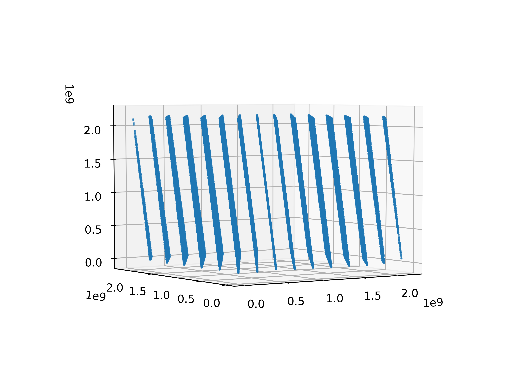

## What are Random Numbers?

. . .

- Statistical Randomness
- Unpredictable Randomness
- True Randomness

::: notes

Before we went on a break,
Paul showed us Perlin noise,
a type of random field which is useful for generating terrain.
This raised the question,
how do you generated random numbers?
So I am taking the opportunity to go into far too much detail
about random numbers.
Before I do,
How would you define a random number?

- Sequence which can't be predicted
- numbers which adhere to a distribution
- sequence of numbers with no correlation

There are three different types of randomness
which I will be discussing today;
statistical randomness, unpredictable randomness, and true randomness.

:::

## Pseudo Random Number Generators

- Default implementation of `random` in most programming languages
- Generates a 'random' sequence of numbers
- Initial state is called the seed

::: notes

When we talk about random numbers
within the context of computer simulations
we are typically referring to Pseudo Random Numbers.
Much of the time when say we want random numbers,
like in a Monte Carlo simulation,
we actually want numbers sampled from a distribution,
a concept sometimes called statistical randomness.
Additionally,
being able to run a simulation multiple times
and getting the same result each time
can be a really useful feature,
rather than getting a different result each time.

A Pseudo Random Number Generator (PRNG)
is an algorithm which takes a known state,
and performs some transformation
on the state to get the next state.
The initial state given to a PRNG
is called the seed,
which allows us to generate
exactly the same sequence of data.

:::

## Linear Congruential Generators

$$ X_{n+1} = (aX_n + c)~\text{mod}~m $$

:::notes

As an example,
lets take the simplest family of pseudo random number generators,
known as linear congruential generators.
These take a number $X$,
and generate the next number in the sequence
using the relation

$$ X_{n+1} = (aX_n + c) \mod m $$

If we choose $a = 1$ and $c=1$ the numbers are not very random,
just counting up to the largest.
With a 'reasonable' choice of $a$ and $c$ you can get
a 'reasonable' random number generator.
However, you *never* want to be using a LCG.

Why?
Let me tell you a story about RANDU

:::

## RANDU

::::::: {.columns}
::: {.column width=50%}
Default random number generator in early versions of FORTRAN

$$ X_{n+1} = 65539~X_n ~ \text{mod}~2^{31} $$

. . .

$$ X_{n+1} =  (2^{16} + 3) X_n ~ \text{mod}~2^{31} $$

. . .

:::
::: {.column width=50%}

:::
::::::

::: notes

This is a random number generator with the relation

$$ X_{n+1} = 65539 X_n mod 2^{31} $$

It was developed by IBM in the early 60s
and used for being simple to calculate,
65539 is $2^{16} + 3$,
making the calculation of the next random number super simple,
basically ignoring the multiplication,
and doing raw bit operations.

However, and this is the fun bit,
when generating points in 3d space,
x,y, and z triples,
all the generated points lie on one of 15 planes,
which is fairly clearly an indication
not a good thing.

:::

## RANDU

::: incremental

* Issues known in 1963
* Widely used throughout the early 70s
* Still implemented in [1999](http://h30266.www3.hpe.com/odl/unix/progtool/cf95au56/dflrm.htmhttp://h30266.www3.hpe.com/odl/unix/progtool/cf95au56/dflrm.htm) and [2001](http://jp.xlsoft.com/documents/intel/cvf/cvf_lref.pdf)

:::

::: notes

Now this was known about in 1963,
however, it was still widely used as a PRNG
throughout the 70s,
particularly with FORTRAN.
So any Monte Carlo results from the 70s
should be taken with a really large grain of salt.
The real problem though,
is that it took so long to deprecate it,
with it still being implemented in compilers
in 1999 and 2001,
which means it is probably still being used.

Generating a good random number generator
with an LCG algorithm is *hard*,
which is why there are standard alternatives in most programming languages.

:::

## What do we use currently?

C++ 11
: Linear Congruential Generator
: Mersenne Twister

Fortran
: Linear Congruential Generator (RAND in Fortran 77)
: Xorshift (RANDOM in Fortran 95)

Python
: Mersenne Twister
: Permutation Congruential Generator (Numpy 1.17)

Julia
: Mersenne Twister
: Permutation Congruential Generator (RandomNumbers)
: Xorshift (RandomNumbers)

Rust
: Permutation Congruential Generator (rand)
: Xorshift (rand)

::: notes

With the implications of a poor choice of PRNG
being so large,
how do we know the ones we are using today are any good?
How do we identify a bad PRNG?

:::

## Statistical Tests

- Coin flip tests
- Birthday Spacings tests
- Information Entropy tests
- Spectral Density tests

## Statistical Test Suites

- [TestU01]
- [DIEHARD]
- [DIEHARDER]
- [NIST][NIST Statistical Test Suite]
- [PracRand]

::: notes

This suite of tests
builds on the idea of statistical randomness.
The simplest being the coin flip test,
or does the sequence of 0s and 1s
match the expected distribution.
The same principle applies to all of the tests,
there is a theoretical distribution,
or expected value which should be true
for a statistically random distribution.
If the values from the PRNG match the expected value
then it passes,
otherwise it fails.
Even a single failure
is an indication of an issue with the PRNG.

Each of the tests are divided up into groups,
with the Big Crush taking about 14 hours to complete,
running 106 different tests.

:::

## Are they any good?

 PRNG             Failures[@ONeill2014]           Period
 ---------------- ---------------------  ---------------
 LCG                              11-22         $2^{31}$
 Mersenne Twister                     4   $2^{19937} -1$
 Xorshift*                            0     $2^{128} -1$
 PCG                                  0        $2^{128}$

::: notes

These are somewhat of a summary of each algorithm,
specific implementations may vary,
and additionally number of failures may vary.

Something I haven't yet mentioned is the period,
which is also displayed up here.
While having a sequence which repeats
is bad for something like a Monte Carlo algorithm,
typically the square root of the entire sequence[@ONeill2014]
is as many calls you want to make to the PRNG.
So for the Xorshift* and PCG generators
you would run out of counting numbers
before reaching that point.

When we run simulations
we don't care about that it is possible
predict the next number in the sequence.
However in other applications,
like gambling,
or cryptography,
or 2 factor authentication tokens,
being able to predict the next number
is really, really bad.

:::

## Cryptographically Secure Pseudo Random Number Generators (CSPRNG)

- Takes a state and modifies it
- Leaks no information about the internal state
- Significantly more complicated algorithms

:::notes

The idea of CSPRNG is still the same,
taking an unknown state,
performing some modification to that state
and generating a value.
The nature of CSPRNG is that the algorithms
are more complex,
so take a lot longer to compute.

Despite these algorithms not leaking state,
if we can find some other way of establishing the state,
say the time that the algorithm started runnning,
it would be possible to replicate.
So at some point we still need a truly random number.

:::

## What if we do want 'true' randomness?

- [Random.org](https://random.org)
- [NIST](https://beacon.nist.gov/beacon/2.0/chain/1/pulse/511433)

::: notes

Computers are terrible at randomness,
they are all about deterministic behaviour.
So instead we have to look to the real world
which is full of random events.
There are a few places on the internet
we can get truly random numbers,
random.org and NIST.

Random.org is a service
which has been operating since 1998,
and uses atmospheric measurements
to generate random data.
This true random number generation
is a slow process,
with 1 bit generated per second on average.
What are some ways my computer
can access the real world
and generate truly random numbers?

We often mention to students that the decimal places
beyond the precision of an instrument are random...
It turns out that computers often have
many measurement instruments,
temperature sensors,
timing sensors,
so taking the measurements from these sensors
allows for small amounts of truly random data.

The generation of this data is slow
so typically a CSPRNG is seeded
with the random data,
and run for a period of time
before being re-seeded
with more truly random data.

:::

## LavaRand

\center

[^1]

[^1]: Image courtesy of [@mahtin](https://twitter.com/mahtin/status/888251632550424577)

:::notes

- Developed and patented by Silicon Graphics in 1996 [@Noll1998]

 - Web security is their business
    - Use random number generators extensively
    - Disastrous implications if random numbers are not random

- RANDU was found to not be random
    - Catastrophic implications if their random number generator is not as random as
      they think it is.
    - As a 'backup' source of randomness use lava lamps
    - Nothing quite like the real world for messing things up.

:::

## Resources

- [PCG Paper [@ONeill2014]][PCG Paper]
- [LavaRand]
- Good Random number generators are (not so) easy to find [@Hellekalek1998]
- [Random.org][random.org intro]
- [`rand()` considered harmful][rand harmful]

## Bibliography

\small

[PCG Paper]: http://www.pcg-random.org/pdf/hmc-cs-2014-0905.pdf
[DIEHARD]: https://en.wikipedia.org/wiki/Diehard_tests
[DIEHARDER]: https://webhome.phy.duke.edu/~rgb/General/dieharder.php
[NIST Statistical Test Suite]: https://nvlpubs.nist.gov/nistpubs/legacy/sp/nistspecialpublication800-22r1a.pdf
[TestU01]: http://simul.iro.umontreal.ca/testu01/tu01.html
[PracRand]: https://sourceforge.net/projects/pracrand/
[LavaRand]: https://blog.cloudflare.com/lavarand-in-production-the-nitty-gritty-technical-details/
[random.org intro]: https://www.random.org/randomness/
[rand harmful]: https://channel9.msdn.com/Events/GoingNative/2013/rand-Considered-Harmful
